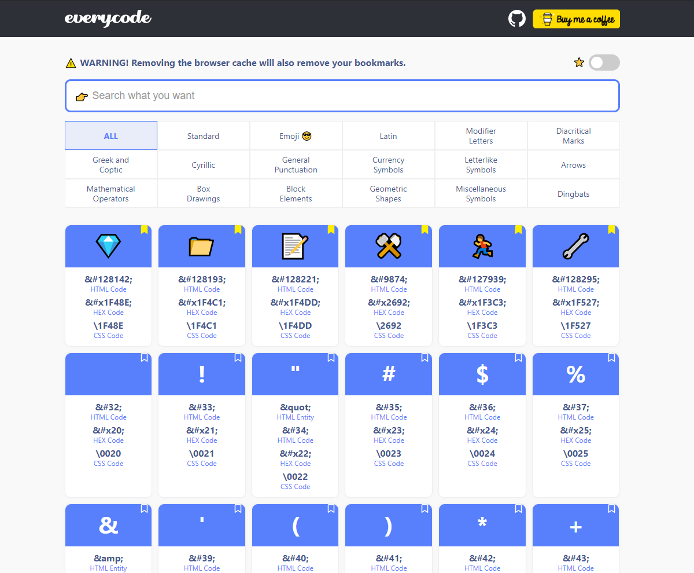

# every-code

website : HTML Entity, Emoji, HTML Currency Symbol and Character Codes for Markup Developers made with GatsbyJS

## 🧐 What's inside?

-   ✨ HTML Code, Hex Code, Css Code, HTML Entity
-   😎 Emoji
-   📝 Copy to Clipboard
-   ⭐ Add to Bookmark
-   👉 Search Characters
